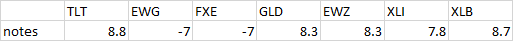
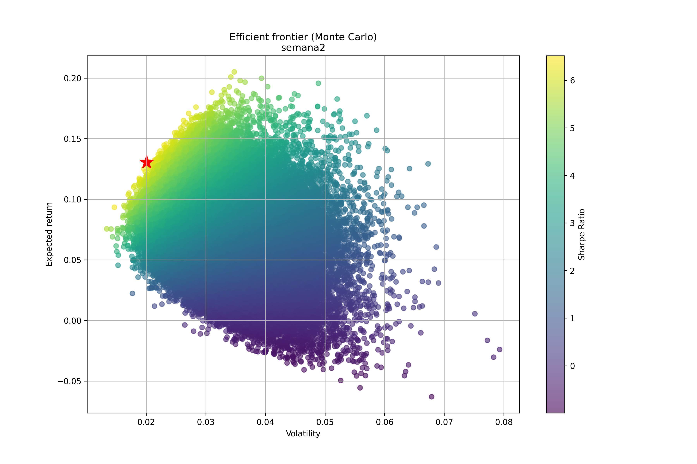

# 📊 JGP2025 - Otimização de Portfólio Topdown com Backtests, RSI e Markowitz


## Sobre o Projeto
Este projeto tem como objetivo otimizar portfólios de investimento através de uma abordagem de três etapas. No cálculo dos máximos e mínimos retornos esperados usamos backtests para identificar o melhor modelo e janela de tempo. No cálculo do RSI também fizemos backtests para estimar o melhor modelo. Para a construção do portfólio eficiente utilizamos Markowitz, com nossos retornos esperados.


#
# 📄 Método de Alocação


### 1. Análise TopDown
Metodologia estruturada para alocação de ativos baseada em análise macroeconômica e consenso da equipe.

#### Estrutura da Equipe:
- **4 Analistas de ETFs** (especializados por setores/regiões)
- **2 Analistas de Portfólio** (gestão e alocação)

#### Metodologia de Avaliação:
1. **Análise Individual**: Cada analista estuda seu grupo de ativos
2. **Discussão em Grupo**: Debate das teses candidatas
3. **Sistema de Notas**: Avaliação de 0 a 10 por cada analista
4. **Índice de Confiança da Tese (ICT)**: Média das notas dos analistas


#
### 2. Fórmula: Retorno Esperado da Tese (RET)

O **Retorno Esperado da Tese** $(RET)$ é um dos pilares deste projeto. Combinamos:

###
- **Índice de Confiança da Tese $(ICT)$:** Representa a média das notas de 0 a 10 dadas pelos analistas para a tese de investimento. É um indicador da confiança coletiva na tese. Confiança na valorização, ou perda, máxima daquele ativo.

  $$CT = \frac{1}{n}  \sum_{i=1}^n Nota_i$$
  $$ICT = CT \times (1 - \frac{\sigma_{Tese}}{n})$$


###
- **Magnitude do Movimento** $(M_{tese})$: Magnitude potencial do movimento de preço do ativo. Separado entre long e short.
    
    $$M_{tese(long)} = ( 1 + \frac{50 - IFR}{50}) \times (\frac{P_{Max} - P_{Atual}}{P_{Atual}})$$
    $$M_{tese(short)} = ( 1 - \frac{50 - IFR}{50}) \times (\frac{P_{Mín} - P_{Atual}}{P_{Atual}})$$


###
- **Índice de Força Relativa $(IFR)$:** Um indicador de análise técnica que mede a mudança na velocidade de movimento dos preço. Indica se haverá reversão de tendência.   

    $$IFR >= 70: Sobre\ compra,\ preços\ inflados\ (vender)$$
  
    $$IFR <= 30: Sobre\  venda,\ preços\ subestimados\ (comprar)$$


###
- **$P_{Max/Mín/Atual}:$** O preço máximo ou mínimo esperado para o ativo são definidos com base na média e desvio padrão dos preços dos ativos. O preço máximo é a média acrescida de dois desvios padrões, o mínimo é a média menos dois desvios padrões $(\mu \ \pm \ 2\sigma)$.


###
- **Sinal $(\pm)$:** O sinal na fórmula depende se a tese é de compra (long) ou venda (short).


###
**Fórmula final** para o retorno esperado $(RET)$:

$$RET = ICT \times (1 \pm \frac{50 - IFR}{50}) \times (\frac{P_{Min/Max} - P_{Atual}}{P_{Atual}})$$


#
### 3. Pesos de cada ativo

Após a definição dos retornos esperados para cada ativo, o modelo utiliza a **otimização de portfólio de Markowitz**. O objetivo principal do modelo é escolher o portfólio eficiente, que oferece o maior retorno esperado para um dado nível de risco.

###
#### Etapas do modelo de Markowitz:

####
1.  **Geração de pesos aleatórios (Monte Carlo):** O script `markowitz.py` gera um grande número de portfólios aleatórios, atribuindo diferentes pesos a cada ativo, respeitando posições short e long.

####
2.  **Cálculo do Sharpe Ratio:** Para cada portfólio gerado, é calculado o Sharpe Ratio.

####
3.  **Carteiras geradas:** Cada portfólio gerado, com suas métricas, é exportado para um arquivo excel e um gráfico.

####
4.  **Seleção do Portfólio Ótimo:** O portfólio com o maior Sharpe Ratio é identificado como o portfólio "ótimo" para o período analisado. Este portfólio é destacado no gráfico e seus pesos são registrados.

####
5.  **Restrições:** Para evitar portfólios não equilibrados podemos impor restrições (ex: somente portfólios com volatilidade abaixo da média).

###
Este método garante que a alocação do portfólio seja baseada em uma análise rigorosa, combinando a análise topdown dos analistas e ferramentas quantitativas.


#
# 📈 Características Técnicas


### Análise de Janelas Justas $(P_{max/min})$:
- **Período de Análise**: Até 721 dias (aproximadamente 2 anos)
- **Granularidade**: Teste de janelas com incrementos de 7 dias
- **Validação**: Backtesting de 1 ano para cada janela
- **Precisão**: Intervalo de confiança de ±1 desvio padrão


### Análise de Janelas Justas $(IFR)$:
- **Período de Análise**: 21 dias (aproximadamente 2 meses)
- **Granularidade**: Teste de janelas com incrementos de 1 hora
- **Validação**: Backtesting de 60 dias para cada janela


### Sistema de Avaliação $(ICT)$:
- **Escala de Notas**: 0 a 10 pontos
- **Índice de Confiança**: Média ponderada das avaliações
- **Penalização**: Redução baseada no desvio padrão das notas
- **Horizonte**: Projeções semanais


#
# 👥 Equipe de Desenvolvimento


### Analistas de Portfólio e Risco:
- **Daniel** - Analista de Portfólio 1
- **João Fernando** - Analista de Portfólio 2


### Analistas de ETFs:
- **Vinicius** - Setores EUA 1 (XLV, XLP, XLF, XLY, XLK)
- **Wilson** - Setores EUA 2 (XLI, XTN, XLB, XLE, XLU)
- **Eduardo** - Bloco Europa-EUA (EWG, SPY, FXE, TLT)
- **Victor** - Emergentes e outros (EEM, EWZ, GLD, EWJ)


#
# 📁Estrutura do Projeto

Visão geral dos principais diretórios e arquivos:

```
.
├── inputs/                  # Arquivos de entrada (ex: 'notes.xlsx')
├── outputs/                 # Saídas geradas
├── tests/                  
├── src/
│   ├── assistants/          # Módulos auxiliares
│   ├── windows_backtests.py # Backtesting de janelas de tempo
│   ├── expeted_return.py    # Cálculo de retornos esperados
│   ├── RSI_calculate.py     # Cálculo do RSI
│   └── markowitz.py         # Implementação de Markowitz
│
├── run_markowitz.py         # Script principal para executar a otimização de Markowitz
├── requirements.txt         # Dependências do projeto
└── README.md               
```


#
# ▶️ Configuração do Ambiente
Antes de executar, crie um ambiente virtual (venv). Certifique-se de ter o (Python >= 3.12) instalado.


###
1.  **Clone o repositório (se aplicável):**

    ```bash
    git clone <URL_DO_REPOSITORIO>
    cd JGP2025
    ```

###
2. **Crie um ambiente virtual, digite no terminal:**
    ```bash
    python -m venv .venv
    ```

###
3. **Ative o ambiente virtual:**
    *   No Windows:
        ```bash
        .\.venv\Scripts\activate
        ```
    *   No macOS/Linux:
        ```bash
        source venv/bin/activate
        ```

###
4.  **Instale as dependências necessárias:**
    ```bash
    pip install -r requirements.txt
    ```


#
# ▶️ Como Executar o Projeto

###
1.  **Inputs necessários:** Para rodar o modelo é necessário entregar uma planilha com ativos nas colunas e as notas $(ICT)$ nas linhas. Ex.:




##
2.  **Rodar a otimização de portfólio**: execute o script principal.

    ```bash
    python run_markowitz.py
    ```

As saídas, incluindo os portfólios otimizados e os gráficos da fronteira eficiente, serão salvas no diretório `outputs/`. Ex.:




#
# 👨‍💻 Autor
* João Fernando
* LinkedIn: https://www.linkedin.com/in/joaoffialho/